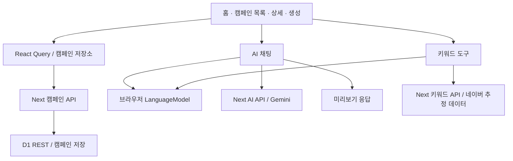

프로젝트 구조 및 UI/UX·개발 개선 검토 — 2026-09-08

검토 대상은 현재 작업 트리의 app, components, lib, d1, 설정 파일과 기존 작업 기록입니다. 여기서 브라우저 AI는 프로젝트의 window.LanguageModel 기반 온디바이스 AI를 뜻합니다. 코드 정적 분석, 타입 검사, 프로덕션 빌드, 린트와 일부 서버 함수의 mock 실행을 수행했습니다. 실제 브라우저 렌더링·모바일 화면·기기별 AI 지연·실제 광고 API의 종단 간 동작은 검증하지 않았습니다. 이 문서는 분석 결과이며 애플리케이션 코드를 수정하지 않았습니다.

**전체 판단:** 간편/전문가 모드와 공통 UI, AI 제안 카드, 네이버 검색 데이터 연결은 갖춰져 있습니다. 다음 단계의 중심은 데이터와 실행 결과를 믿을 수 있게 만들고, 현재 화면의 문맥을 AI에 전달하며, 준비된 로컬 AI가 짧은 작업을 반복해서 처리하도록 만드는 것입니다. 현재 상태는 일부 실제 API를 연결한 광고 관리 프로토타입으로 판단합니다.

**현재 구조와 구현 범위**

| 계층 | 위치 | 역할과 관찰 |
|---|---|---|
| 프레임워크 | package.json, next.config.ts | Next.js 16.3.4 App Router, React 19.2.8, TypeScript. Emotion 컴파일러 사용 |
| 화면 | app/page.tsx, app/campaigns/** | 홈, 캠페인 요약/목록, 상세 설정, 신규 생성. 네 개의 주요 페이지는 Client Component |
| 공통 레이아웃·UI | components/layout, components/ui, components/providers | AppShell, 전역 AssistantDock, 모드 전환, React Query·테마 Provider |
| 도메인·조회·변경 | lib/mock/types.ts, store.ts, campaignsRepository.ts | 실제 API 저장소와 데모 데이터가 mock 폴더에 혼재 |
| 캠페인 API·DB | app/api/campaigns/**, lib/d1.ts, d1/schema.sql | Next Route Handler에서 Cloudflare D1 REST 호출. 캠페인 설정을 DB에 저장 |
| AI | lib/ai/**, components/assistant/** | 채팅은 브라우저 모델 → Gemini 서버 API → 미리보기. 키워드는 네이버 → 브라우저 모델 → 미리보기 |
| 광고 데이터 | lib/ads/naverSearchAd.ts, app/api/keywords/naver/** | 네이버 검색량, 연관 키워드, 입찰가·성과 추정 조회 |
| 분석 규칙 | lib/insights.ts | ROAS 분류, 입찰 조정 후보, 짧은 인사이트를 코드 규칙으로 산출 |



이 그림의 AI 연결은 현재 대체 경로를 나타내며 동시 호출을 뜻하지 않습니다.

- 캠페인 CRUD는 실제 D1 저장 경로를 사용합니다. 다만 최초 성과 history는 고정 난수로 만든 데모이며 신규 캠페인의 history는 비어 있습니다. [lib/mock/campaigns.ts:15](D:/file_hyebinkim/development/ads/lib/mock/campaigns.ts:15), [app/campaigns/new/page.tsx:133](D:/file_hyebinkim/development/ads/app/campaigns/new/page.tsx:133)
- 네이버 연동은 조회·추정까지입니다. 실제 광고 계정에 캠페인 생성, 예산 변경, 중지, 성과 동기화를 수행하는 연결은 확인되지 않았습니다. AI 적용은 현재 이 앱의 D1 설정 변경입니다. [lib/ads/naverSearchAd.ts:3](D:/file_hyebinkim/development/ads/lib/ads/naverSearchAd.ts:3), [lib/ai/applyAction.ts:4](D:/file_hyebinkim/development/ads/lib/ai/applyAction.ts:4)
- 일반 Next.js 서버에서 D1 REST를 쓰는 구성입니다. Workers 배포 설정은 확인되지 않았습니다. D1 사용 자체가 Workers 배포를 의미하지 않습니다. 외부 서버의 REST 사용은 지원되는 방식입니다. [D1 REST 공식 문서](https://developers.cloudflare.com/api/resources/d1/subresources/database/methods/query/)

**우선 처리할 신뢰성 문제**

P0는 외부 운영 전 해결할 항목, P1은 잘못된 판단·설정·저장 결과로 이어지는 항목, P2는 작업 속도와 사용성을 개선하는 항목입니다.

| 우선순위 | 확인된 사실·영향 | 권장 변경 | 코드 근거 |
|---|---|---|---|
| P0 | 캠페인 조회·수정·삭제·초기화에 코드상 인증·소유권 검사가 없음. 초기화는 전체 테이블 삭제. 외부 배포 계층의 접근 제한은 미확인 | API 인증·계정 범위 검사, reset은 개발 환경 한정 | [app/api/campaigns/route.ts:22](D:/file_hyebinkim/development/ads/app/api/campaigns/route.ts:22), [[app/api/campaigns/[id]/route.ts:6]], [app/api/campaigns/reset/route.ts:11](D:/file_hyebinkim/development/ads/app/api/campaigns/reset/route.ts:11) |
| P0 | 요청 본문을 타입 캐스팅만 함. 음수 예산·잘못된 status·문자열 targeting이 DB까지 전달 가능 | 서버 런타임 검증, 숫자 범위·enum·배열 제한, 명시적 변경 필드, DB 제약 | [[app/api/campaigns/[id]/route.ts:12]], [d1/schema.sql:5](D:/file_hyebinkim/development/ads/d1/schema.sql:5) |
| P1 | 간편모드 ‘전환 수’는 clicks, ‘이번 달’ 광고비는 최근 14개 기록. 전문가모드 ROAS 증감은 매출 증감 | 날짜가 있는 지표 모델과 공통 집계 함수. 화면·AI에서 동일 기간과 지표 사용 | [app/page.tsx:63](D:/file_hyebinkim/development/ads/app/page.tsx:63), [app/page.tsx:94](D:/file_hyebinkim/development/ads/app/page.tsx:94), [app/page.tsx:176](D:/file_hyebinkim/development/ads/app/page.tsx:176) |
| P1 | 조회 초기값이 데모이고 hook이 error/loading을 반환하지 않음. DB 실패 시 데모가 실제 데이터처럼 남을 수 있음 | demo/live를 명시적으로 분리하고 loading/error/empty/stale를 노출. AI에도 source·asOf 전달 | [lib/mock/store.ts:10](D:/file_hyebinkim/development/ads/lib/mock/store.ts:10), [lib/mock/campaignsRepository.ts:29](D:/file_hyebinkim/development/ads/lib/mock/campaignsRepository.ts:29) |
| P1 | ‘추천 받기’가 키워드 추가·예산 감소를 바로 실행. 규칙만 실행하는 배너가 ‘AI가 분석’ 및 타겟·소재 개선을 표시 | 추천 보기 → 대상·근거·변경 전후 확인 → 적용. 규칙 추천과 AI 설명을 구분 | [components/dashboard/SimpleQuickActions.tsx:44](D:/file_hyebinkim/development/ads/components/dashboard/SimpleQuickActions.tsx:44), [components/campaigns/SimpleAiRecommendBanner.tsx:32](D:/file_hyebinkim/development/ads/components/campaigns/SimpleAiRecommendBanner.tsx:32) |
| P1 | 비동기 저장을 기다리지 않고 ‘적용 완료’ 표시. applyAction은 Promise를 반환하지 않음 | 실행 Promise를 끝까지 반환하고 pending/success/error/retry를 표시 | [lib/ai/applyAction.ts:4](D:/file_hyebinkim/development/ads/lib/ai/applyAction.ts:4), [components/assistant/ActionProposalCard.tsx:67](D:/file_hyebinkim/development/ads/components/assistant/ActionProposalCard.tsx:67) |
| P1 | 상세의 키워드 입찰가 편집은 저장 콜백이 없고 기존 저장값도 초기화되지 않음 | keywordBids를 입력값으로 받고 onBidsChange를 상세 저장에 연결 | [[app/campaigns/[id]/page.tsx:245]], [components/campaigns/KeywordAssistant.tsx:169](D:/file_hyebinkim/development/ads/components/campaigns/KeywordAssistant.tsx:169) |
| P1 | 네이버 일부 요청 실패가 0 검색량·0 예상 비용으로 바뀜 | 실제 0, 조회 실패, 데이터 부족, 추정치를 분리. nullable 수치·상태·조회 시각 보존 | [lib/ads/naverSearchAd.ts:155](D:/file_hyebinkim/development/ads/lib/ads/naverSearchAd.ts:155), [lib/ads/naverSearchAd.ts:234](D:/file_hyebinkim/development/ads/lib/ads/naverSearchAd.ts:234), [app/api/keywords/naver/route.ts:16](D:/file_hyebinkim/development/ads/app/api/keywords/naver/route.ts:16) |

AI 제안의 JSON 출력 제약은 실행 권한·사업 규칙 검증을 대신하지 않습니다. 현재 파서는 reply 문자열과 actions 배열 여부만 확인하며, 예산 30% 제한은 프롬프트에만 있습니다. action type·campaignId·percent·riskLevel을 런타임에서 검증하고 서버의 동일한 변경 경로에서 다시 제한해야 합니다. update_targeting은 스키마에 있지만 실행 switch에서는 처리되지 않아 무동작 뒤 완료 표시가 가능합니다. [lib/ai/useLanguageModel.ts:37](D:/file_hyebinkim/development/ads/lib/ai/useLanguageModel.ts:37), [lib/ai/schema.ts:22](D:/file_hyebinkim/development/ads/lib/ai/schema.ts:22), [lib/ai/systemPrompt.ts:6](D:/file_hyebinkim/development/ads/lib/ai/systemPrompt.ts:6), [lib/ai/applyAction.ts:6](D:/file_hyebinkim/development/ads/lib/ai/applyAction.ts:6)

ROAS 분류도 개선 대상입니다. history가 없는 신규 캠페인을 ‘아쉬워요’로 분류하며, 업종·목표와 관계없이 동일한 임계값을 사용합니다. 표본 부족은 ‘집계 중’으로 구분하고 목표 CPA/ROAS와 비교해야 합니다. 그룹 성과를 나타낼 때는 단순 캠페인 ROAS 평균인지, 합산 매출/합산 비용인지도 명확히 해야 합니다. [lib/insights.ts:95](D:/file_hyebinkim/development/ads/lib/insights.ts:95), [lib/insights.ts:112](D:/file_hyebinkim/development/ads/lib/insights.ts:112)

**브라우저 AI가 현재 충분히 활용되지 못하는 이유**

1. **한국어 처리 경로가 실제 지원 범위와 맞지 않습니다.** 채팅은 availability/create에 ko를 정확히 선언하고 있어 미지원이면 로컬을 건너뜁니다. 이 판정 자체를 제거할 문제가 아니라 한국어 작업을 처리할 대체 설계가 없는 문제입니다. 반면 키워드 hook은 언어 옵션 없이 한국어 시스템·사용자 프롬프트를 전송하므로 두 기능의 지원 판정이 일치하지 않습니다. [lib/ai/useLanguageModel.ts:23](D:/file_hyebinkim/development/ads/lib/ai/useLanguageModel.ts:23), [lib/ai/useLanguageModel.ts:67](D:/file_hyebinkim/development/ads/lib/ai/useLanguageModel.ts:67), [lib/ai/useKeywordAssistant.ts:54](D:/file_hyebinkim/development/ads/lib/ai/useKeywordAssistant.ts:54), [lib/ai/keywordPrompt.ts:5](D:/file_hyebinkim/development/ads/lib/ai/keywordPrompt.ts:5)

   확인한 Chrome Prompt API 공식 문서(2026-08-26 갱신)는 지원 언어를 en/ja/es/de/fr로 명시하며 ko는 포함하지 않습니다. 지원 언어·기기는 변경될 수 있어 실제 옵션으로 기능 감지가 필요합니다. [Prompt API 공식 문서](https://developer.chrome.com/docs/ai/prompt-api)

2. **모델 준비와 추론이 하나의 6초 대기 안에 섞여 있습니다.** 로컬이 지연되면 최대 6초 뒤 클라우드를 시작하고 거기서 다시 12초를 기다려 미리보기로 넘어갑니다. 해당 경로의 대기 임계값 합계는 약 18초이며 실측 지연은 아닙니다. Promise.race만 사용해 시간 초과된 연산·fetch는 계속될 수 있습니다. 성공 후 타이머도 정리되지 않아 로컬 성공 뒤 타임아웃 로그가 나올 수 있습니다. [lib/ai/useLanguageModel.ts:127](D:/file_hyebinkim/development/ads/lib/ai/useLanguageModel.ts:127), [lib/ai/useLanguageModel.ts:138](D:/file_hyebinkim/development/ads/lib/ai/useLanguageModel.ts:138), [lib/ai/useLanguageModel.ts:157](D:/file_hyebinkim/development/ads/lib/ai/useLanguageModel.ts:157)

3. **키워드는 네이버 응답을 제한 시간 없이 먼저 기다립니다.** 그다음 로컬을 생성하므로 최초 모델 준비가 필요한 경우 사용자 클릭으로부터 시간이 지나 create가 실패할 가능성도 점검해야 합니다. 또한 추천 성공 콜백이 입찰 추정을 await하여 키워드 목록 확인까지 늦출 수 있습니다. [lib/ai/useKeywordAssistant.ts:104](D:/file_hyebinkim/development/ads/lib/ai/useKeywordAssistant.ts:104), [lib/ai/naverKeywordClient.ts:56](D:/file_hyebinkim/development/ads/lib/ai/naverKeywordClient.ts:56), [components/campaigns/KeywordAssistant.tsx:191](D:/file_hyebinkim/development/ads/components/campaigns/KeywordAssistant.tsx:191)

4. **질문마다 전체 캠페인과 모든 키워드를 전달합니다.** 현재 페이지, 선택 캠페인, 조회 기간, 사용자가 보던 지표 정보가 없습니다. 로컬 세션에는 이전 프롬프트가 누적되므로 전체 현황 반복 삽입은 문맥을 빨리 소모합니다. [components/assistant/AssistantDock.tsx:56](D:/file_hyebinkim/development/ads/components/assistant/AssistantDock.tsx:56), [lib/ai/context.ts:5](D:/file_hyebinkim/development/ads/lib/ai/context.ts:5), [lib/ai/context.ts:37](D:/file_hyebinkim/development/ads/lib/ai/context.ts:37)

5. **클라우드에는 대화 이력이 전달되지 않습니다.** UI에는 이전 대화가 보이지만 요청에는 현재 message와 campaigns만 있고 Gemini contents도 단일 turn입니다. ‘그중 두 번째 캠페인은?’ 같은 후속 질문은 로컬과 클라우드에서 문맥이 달라질 수 있습니다. [lib/ai/geminiChatClient.ts:11](D:/file_hyebinkim/development/ads/lib/ai/geminiChatClient.ts:11), [lib/ai/geminiClient.ts:66](D:/file_hyebinkim/development/ads/lib/ai/geminiClient.ts:66)

6. **AI 이용 상태가 여러 곳에 따로 존재합니다.** 두 hook에 세션 생성·다운로드·타임아웃 로직이 중복됩니다. 홈 패널은 요청 없이 2.2초마다 ‘분석 중’을 반복하고, 배너는 미지원/오류/확인 중을 미리보기로 표시해 실제 클라우드 응답과 어긋납니다. [lib/ai/useKeywordAssistant.ts:68](D:/file_hyebinkim/development/ads/lib/ai/useKeywordAssistant.ts:68), [components/dashboard/SimpleAssistantPanel.tsx:18](D:/file_hyebinkim/development/ads/components/dashboard/SimpleAssistantPanel.tsx:18), [components/assistant/AvailabilityBanner.tsx:24](D:/file_hyebinkim/development/ads/components/assistant/AvailabilityBanner.tsx:24)

**더 빠르게 만드는 구현 방향**

| 순서 | 구현 방향 | 예상 효과와 조건 |
|---|---|---|
| 1 | 공통 AI 실행 관리: capability, preparation, task state, actual engine, failure reason을 한 곳에서 관리 | 지원하지 않는 경로의 반복 대기와 화면별 상태 불일치 감소 |
| 2 | ‘브라우저 AI 준비’ 버튼 또는 AI 패널을 여는 사용자 동작으로 준비 시작. 준비된 세션은 재사용 | 모델 다운로드를 실제 질문의 대기 시간과 분리. 임의의 백그라운드 다운로드를 전제로 하지 않음 |
| 3 | 요청마다 AbortController, deadline, requestId 부여. 만료된 로컬·네트워크 작업 취소 및 늦은 결과 무시 | 화면이 다음 단계로 넘어간 뒤 남는 연산과 응답 충돌 감소 |
| 4 | 채팅은 foreground queue, 자동 요약은 낮은 우선순위. 서로 다른 작업 문맥은 분리 | 동시 전송이 한 세션의 대화를 섞거나 사용자 요청을 밀어내지 않도록 관리 |
| 5 | campaignId·period·task 중심으로 컨텍스트 선택. 이미 계산한 지표와 관련 대상만 전달 | 프롬프트 크기·불필요한 설명·추가 질문 감소 |
| 6 | 기간 집계·정렬·중복 제거는 코드로 즉시 처리. AI는 해석·모호한 분류·대안 설명 담당 | 단순 계산마다 모델을 기다리지 않고 결과의 정확성 확보 |
| 7 | 검증된 동일 질문 결과와 작업별 요약 캐시. 키는 계정·데이터 버전·기간·프롬프트 버전·언어·엔진 포함 | 반복 분석 비용 감소. 예산·키워드 변경 시 관련 캐시 무효화, 과거 제안 재실행 방지 |
| 8 | 응답 설명을 스트리밍하거나 단계별 결과를 먼저 표시. 최종 JSON 검증 후 액션 활성화 | 첫 결과를 빨리 확인. 부분 JSON을 실행 가능한 제안으로 다루지 않음 |
| 9 | 네이버 후보 목록을 먼저 보여주고 입찰 추정은 별도 상태로 진행 | 일부 느린 추정 때문에 전체 추천 화면이 묶이지 않음 |
| 10 | PATCH 응답으로 해당 캠페인 캐시만 갱신. 서버의 불필요한 COUNT·전체 재조회 제거 | AI 답변 이후 실제 적용 완료까지의 대기 감소 |

모델 초기 다운로드에는 사용자 동작이 필요할 수 있고, 다운로드 전·중·완료 상태를 구분해야 합니다. [준비·사용자 동작 공식 문서](https://developer.chrome.com/docs/ai/get-started)

현재 세션 재사용은 hook 내부에 이미 구현돼 있습니다. 이를 무조건 많은 세션을 만드는 방향으로 확장하지 않고, 작업 종류별로 제한된 세션을 관리하고 같은 시스템 프롬프트의 독립 작업에만 clone을 검토하는 편이 적절합니다. 대화 이력은 공통 형식으로 보관하고 각 엔진이 같은 최근 대화·요약을 받게 해야 합니다. [세션 관리 공식 문서](https://developer.chrome.com/docs/ai/session-management)

Prompt API에는 promptStreaming과 AbortSignal이 있으며, 현재 프로젝트는 prompt만 호출하고 signal 타입도 없습니다. 타입 선언을 실제 사용하는 API에 맞게 보완해야 합니다. 공식 문서상 Prompt API는 Web Worker에서 사용할 수 없으므로 모델 호출 자체를 Worker로 옮기는 최적화는 현재 적용 대상으로 삼지 않습니다. [Prompt API 공식 문서](https://developer.chrome.com/docs/ai/prompt-api)

키워드 조회 규모도 정렬이 필요합니다. UI는 8/30/300개를 제공하지만 입찰 추정은 처음 20개만 처리합니다. ‘많이’ 요청 후 전 후보의 비용이 검토된 것처럼 보이지 않도록 분석 대상 수를 표시하고 선택 후보 우선 조회·페이지별 추가 분석을 제공해야 합니다. [components/campaigns/KeywordAssistant.tsx:50](D:/file_hyebinkim/development/ads/components/campaigns/KeywordAssistant.tsx:50), [lib/ads/naverSearchAd.ts:202](D:/file_hyebinkim/development/ads/lib/ads/naverSearchAd.ts:202)

**한국어 서비스에서 로컬 AI를 활용하는 현실적인 방식**

- 선택형 작업부터 도입합니다. 예를 들어 ‘이 캠페인 상태 설명’은 코드가 지표를 계산하고 캠페인 이름 대신 ID, 정규화한 영어 task·지표를 로컬 모델에 전달합니다. 모델은 reasonCode·priority·관련 ID 등 제한된 결과를 반환하고 화면은 한국어 문구와 원래 이름으로 표시합니다. 입력 의미가 명확한 작업은 번역 호출 없이 구성할 수 있습니다.
- 자유로운 한국어 질문은 별도 경로가 필요합니다. 한국어↔영어 Translator API와 영어 Prompt API를 연결하는 방식은 실험 후보입니다. 공식 Translator 문서에는 ko가 포함돼 있지만 실제 언어 쌍의 availability를 확인해야 합니다. [Translator API 공식 문서](https://developer.chrome.com/docs/ai/translator-api)
- 번역 경로에서는 캠페인 ID·금액·키워드 원문을 따로 보존하고, 숫자와 실행 payload는 번역된 자유 문장에서 추출하지 않습니다. 원문 검색어를 번역된 단어로 광고에 등록해서도 안 됩니다.
- 번역에는 추가 준비·추론 시간이 발생합니다. 준비된 상태에서의 지연과 한국어 의도 보존을 측정한 뒤 채택해야 하며 ‘로컬이면 항상 빠르다’고 볼 수 없습니다.
- 로컬을 사용할 수 없는 환경에서는 선택한 데이터 처리 정책에 따라 클라우드 또는 명시적인 기능 제한을 보여줍니다. 클라우드로 전환될 수 있는데 ‘이 브라우저에서만 처리’라고 안내하지 않습니다. 모바일도 동일한 작업 UI를 제공하되 지원 경로를 별도로 선택합니다.

**AI를 더 적극적으로 쓰게 만드는 UI/UX**

| 위치 | 제안하는 경험 | AI와 기존 코드의 역할 |
|---|---|---|
| 홈 | 실제 데이터 기준 ‘오늘 확인할 3가지’ → 근거 보기 → 관련 캠페인으로 이동 | 이상 지표 후보는 코드, 짧은 설명·우선순위 보조는 AI. 데이터 변경 시 요약 갱신 |
| 캠페인 상세 | ‘이 캠페인 분석’·‘지난 7일 변화 설명’ 버튼 | 현재 campaignId·기간을 포함해 AI 열기. 이미 아는 대상을 다시 질문하지 않음 |
| 신규 생성 | ‘강남 필라테스, 하루 3만 원, 상담 문의가 목표’ → 구조화한 초안 → 누락 필수값만 질문 → 검토 | AI는 초안을 작성하고 서버가 값 검증. 채널에 맞는 단계만 노출 |
| 키워드 도구 | 검색 의도별 묶음, 관련성 낮은 후보 설명, 제외 키워드 후보, 기존 키워드와 비교 | 네이버 수치는 사실 자료로 유지. AI 분류에는 한국어 지원 경로 검증 필요. 단순 중복은 코드 처리 |
| 성과 리포트 | 기간 선택 → 검증된 수치 → AI 설명 초안 → 다운로드/복사 | 수치·증감은 코드, 설명 문장은 AI. 현재 ‘준비 중’ 링크를 유용한 작업으로 연결 |
| 예산·입찰 변경 | 대상·근거·전후 값·적용 범위를 한 카드에서 검토하고 적용 결과 확인 | AI는 제안, 서버는 검증·실행. 이력과 데이터 버전으로 중복·낡은 제안 차단 |

구체적인 진입점은 openAssistantDock({ campaignId, task, period, prompt })처럼 확장할 수 있습니다. 현재 boolean 열기 기능을 유지하면서 문맥 옵션을 추가하면 기존 버튼과 호환시키기 쉽습니다. [lib/ui/assistantDock.ts:29](D:/file_hyebinkim/development/ads/lib/ui/assistantDock.ts:29)

자동 분석은 화면을 볼 때마다 모든 캠페인을 추론하는 방식으로 시작하지 않습니다. 코드 집계 → 변경된 대상 감지 → 현재 화면에서 필요한 설명만 낮은 우선순위로 생성 → 저장된 결과 재사용 순서가 적절합니다. 예산 변경은 기존 적용 확인 흐름을 완성한 뒤 연결합니다.

**추가로 확인한 UX 보완점**

- 한국어 입력 Enter 처리에 isComposing 보호가 없습니다. 전송 중 재전송·취소·재시도 처리를 추가하고, 실제 스크롤 컨테이너에 대화 하단 이동을 연결해야 합니다. 현재 ref는 스크롤 영역 내부의 일반 div에 있습니다. [components/assistant/AssistantDock.tsx:115](D:/file_hyebinkim/development/ads/components/assistant/AssistantDock.tsx:115), [components/assistant/AssistantDock.tsx:147](D:/file_hyebinkim/development/ads/components/assistant/AssistantDock.tsx:147), [components/ui/SlideOver.tsx:114](D:/file_hyebinkim/development/ads/components/ui/SlideOver.tsx:114)
- 모달은 dialog·Escape 처리는 있지만 초기 포커스, 포커스 제한·복귀, 배경 비활성화가 없습니다. 입력 label, 대화 log/live 안내와 함께 키보드만으로 질문·검토·적용을 끝낼 수 있어야 합니다. [components/ui/SlideOver.tsx:123](D:/file_hyebinkim/development/ads/components/ui/SlideOver.tsx:123)
- 새 캠페인은 10단계 고정 흐름이며 소셜·영상만 선택해도 검색 순위를 묻습니다. 초안 자동 저장, 채널별 단계 분기, 제출 중 차단·실패 재시도가 필요합니다. [app/campaigns/new/page.tsx:17](D:/file_hyebinkim/development/ads/app/campaigns/new/page.tsx:17), [app/campaigns/new/page.tsx:115](D:/file_hyebinkim/development/ads/app/campaigns/new/page.tsx:115), [app/campaigns/new/page.tsx:327](D:/file_hyebinkim/development/ads/app/campaigns/new/page.tsx:327)
- 입찰가 수동 변경 후 비용 계산은 변경 값을 반영하지 않습니다. 추천 자동 선택은 기존 selected를 교체합니다. 변경 전후 비교, 추가/교체 구분, 재추정 상태를 제공해야 합니다. [components/campaigns/KeywordAssistant.tsx:253](D:/file_hyebinkim/development/ads/components/campaigns/KeywordAssistant.tsx:253), [components/campaigns/KeywordAssistant.tsx:297](D:/file_hyebinkim/development/ads/components/campaigns/KeywordAssistant.tsx:297), [components/campaigns/KeywordAssistant.tsx:308](D:/file_hyebinkim/development/ads/components/campaigns/KeywordAssistant.tsx:308)
- 목록 필터·요약/목록 선택은 URL에 없어 이동 후 복원이 어렵고, /campaigns/new에서는 두 메뉴가 동시에 활성화됩니다. [app/campaigns/page.tsx:27](D:/file_hyebinkim/development/ads/app/campaigns/page.tsx:27), [components/layout/AppShell.tsx:20](D:/file_hyebinkim/development/ads/components/layout/AppShell.tsx:20)
- 모바일은 마법사 미리보기가 아래로 내려가는데 ‘오른쪽’ 안내가 남습니다. 주요 검토·적용 동작을 화면 하단 요약 영역으로 모으는 개선 후보입니다. 실제 화면 크기별 잘림·배치·색 대비는 브라우저로 별도 확인해야 합니다.

**개발 구조와 데이터 처리 보완**

전체 재설계보다 기존 경계를 명확히 하는 정도가 적절합니다.

```text
lib/campaigns/  도메인 타입, 집계, 저장소, query/mutation, 서버 검증
lib/demo/       시드와 명시적인 미리보기 응답
lib/ai/         공통 실행 관리, 작업별 프롬프트, 컨텍스트, 결과 검증
lib/ads/        네이버 조회 어댑터와 데이터 출처
components/    기존 화면·공통 UI 구조 유지
```

- 현재 단순 PATCH도 DB REST 호출이 4회, 비율 예산 변경·타겟 병합은 6회 발생합니다. PATCH 응답을 버리고 전체 목록을 재조회하며, 각 GET이 COUNT+SELECT를 수행하기 때문입니다. 불필요한 재조회를 제거한 후에 배포 위치 변경을 검토합니다. [lib/mock/campaignsRepository.ts:15](D:/file_hyebinkim/development/ads/lib/mock/campaignsRepository.ts:15), [lib/mock/campaignsRepository.ts:43](D:/file_hyebinkim/development/ads/lib/mock/campaignsRepository.ts:43), [app/api/campaigns/route.ts:9](D:/file_hyebinkim/development/ads/app/api/campaigns/route.ts:9)
- GET에서 자동 시드를 제거합니다. 마지막 캠페인 삭제 후 GET하면 데모가 다시 생기며, 동시 초기화는 중복 키 오류가 가능합니다. 초기화는 명시적인 개발 작업으로 옮기고 원자적으로 처리해야 합니다. [app/api/campaigns/route.ts:7](D:/file_hyebinkim/development/ads/app/api/campaigns/route.ts:7), [app/api/campaigns/reset/route.ts:11](D:/file_hyebinkim/development/ads/app/api/campaigns/reset/route.ts:11)
- 서버에서 예산 비율 연산을 수행하고 version/updatedAt 충돌 검사와 actionId 중복 방지를 도입합니다. 현재 브라우저의 읽기→계산→전체 필드 쓰기는 여러 탭·여러 제안이 변경을 덮어쓸 수 있습니다. 되돌리기도 이후 변경 여부를 검사해야 합니다. [lib/mock/campaignsRepository.ts:43](D:/file_hyebinkim/development/ads/lib/mock/campaignsRepository.ts:43), [lib/mock/campaignsRepository.ts:54](D:/file_hyebinkim/development/ads/lib/mock/campaignsRepository.ts:54)
- history는 날짜 없이 D-13 등의 상대 label로 저장됩니다. 실제 성과 연동 시 날짜·채널·계정 기준 지표와 수집 시각을 보존하고, 기간 집계가 필요한 규모에서 지표 테이블을 분리합니다. [lib/mock/types.ts:32](D:/file_hyebinkim/development/ads/lib/mock/types.ts:32), [d1/schema.sql:10](D:/file_hyebinkim/development/ads/d1/schema.sql:10)
- 네이버 추정은 중간·최소·순위 조회 3회 후 키워드별 성과 조회를 병렬 실행합니다. 20개면 최대 23회 upstream 호출입니다. 동시성 상한, 요청 중복 병합, 계정/검색어/device/기간 기준의 짧은 캐시, 실패한 항목만 재시도를 추가할 지점입니다. [lib/ads/naverSearchAd.ts:209](D:/file_hyebinkim/development/ads/lib/ads/naverSearchAd.ts:209), [lib/ads/naverSearchAd.ts:234](D:/file_hyebinkim/development/ads/lib/ads/naverSearchAd.ts:234)
- KeywordAssistant 885줄과 생성 페이지 556줄에 UI·진행 단계·선택·입찰 계산이 모여 있습니다. 입찰 계산/선택 정책과 요청 hook을 먼저 분리하면 저장 누락·비용 계산 불일치의 재발을 줄일 수 있습니다.
- React Query는 브라우저 싱글턴을 유지할 수 있지만 서버 렌더는 요청별 분리가 필요합니다. ‘use client이므로 서버에서 실행되지 않는다’는 가정으로 SSR을 확대하지 않아야 합니다. 로컬 Next 가이드도 서버마다 QueryClient 생성, 브라우저는 재사용하는 패턴입니다. [lib/queryClient.ts:3](D:/file_hyebinkim/development/ads/lib/queryClient.ts:3), [node_modules/next/dist/docs/01-app/02-guides/client-side-data-fetching/tanstack-query.md:23](D:/file_hyebinkim/development/ads/node_modules/next/dist/docs/01-app/02-guides/client-side-data-fetching/tanstack-query.md:23)
- Emotion을 바로 교체할 필요는 없습니다. 현재 빌드는 통과하지만 서버 렌더·스트리밍 확대 시 스타일 삽입과 hydration 동작을 검증해야 합니다. 설치된 Next 가이드에 CSS-in-JS의 지원 및 registry 주의사항이 있습니다. [node_modules/next/dist/docs/01-app/02-guides/css-in-js.md:11](D:/file_hyebinkim/development/ads/node_modules/next/dist/docs/01-app/02-guides/css-in-js.md:11)
- README는 초기 Next 템플릿입니다. 환경 변수 이름과 역할만 담은 .env.example, D1 스키마/시드 절차, 데모·운영 구분, AI 지원 범위, 배포 절차를 문서화해야 합니다. 저장소에서 테스트 스크립트·테스트 파일·CI 설정은 확인되지 않았습니다.

**권장 작업 순서와 완료 기준**

| 단계 | 작업 묶음 | 완료 기준 |
|---|---|---|
| 1 | 지표·데이터 출처, 저장 피드백, 입찰 저장 연결, API 검증·권한 | 데모/실데이터/오류가 구별되고 저장 실패를 성공으로 표시하지 않음. 잘못된 예산·중복 액션 거부 |
| 2 | 공통 AI 준비·경로·취소, 화면 문맥 전달, 클라우드 대화 이력 | 준비 여부를 확인할 수 있고 지원하지 않는 로컬 경로 대기를 생략. 후속 질문이 같은 대상을 유지 |
| 3 | 짧은 로컬 분석, 컨텍스트 축소, 결과 캐시, 단계별 추천 표시 | 동일 작업의 warm 지연·프롬프트 크기·추가 질문 수가 기존보다 개선됐는지 계측 |
| 4 | 자연어 생성 초안, 문맥별 AI 버튼, 키워드 분류, 리포트 | 기존 수동 흐름과 결과를 비교해 작업 완료까지의 입력/클릭 수 감소. 실제 수치를 AI가 만들어내지 않음 |

계측할 항목은 capabilityCheckMs, modelPreparationMs, sessionCreateMs, firstOutputMs, completeMs, actionApplyMs, 실제 engine, fallbackReason, context 크기, JSON 검증 실패율, 취소율입니다. cold/warm, 작업 종류, 지원 기기별로 구분하고 첫 표시와 최종 완료의 p50/p95를 함께 봅니다. 브라우저 AI 이용률도 모든 방문자 비율과 지원 가능한 기기에서의 비율을 나누어야 합니다. 현재 측정값은 없으므로 성능 향상 배수·응답 시간 보장은 제시하지 않습니다.

최소 회귀 검증은 잘못된 지표 집계, 신규 캠페인 표본 부족, API 오류와 데모 구분, 저장 실패/중복 적용, 시간 초과 후 취소, 한국어 조합 입력, 클라우드 후속 대화, 네이버 부분 실패, 입찰가 저장·재조회에 집중하는 것이 좋습니다. AI 품질 평가는 대표 캠페인·한국어 요청·애매한 대상·잘못된 수치 요구를 고정 사례로 두고, 올바른 대상 선택·숫자 보존·안전한 제안을 검사합니다.

**이번 검증 결과**

| 검증 | 결과 |
|---|---|
| node node_modules/typescript/bin/tsc --noEmit --incremental false | 통과 |
| npm run build | 통과. Next.js 16.3.4 프로덕션 빌드·페이지 생성 완료 |
| npm run lint | 실패 1개: lib/theme/emotion.d.ts:5, @typescript-eslint/no-empty-object-type |
| 메모리 내 TypeScript 실행 + mock DB | 음수 예산/잘못된 status/문자열 targeting 전달 시 검증 없이 DB 호출 및 mock 기준 200 재현 |
| PATCH null mock 요청 | 오류 처리 밖 TypeError 재현 |
| 네이버 429 mock 응답 | fetchExactKeywordStats가 오류 대신 빈 Map을 반환하는 동작 재현 |
| 실제 브라우저·AI 모델·D1/네이버 통합 | 미실시. 정적 UI 리뷰와 mock 검증을 실환경 검증으로 간주하지 않음 |

이번 작업에서 생성한 산출물은 이 분석 문서입니다. 기존 AGENTS.md 변경과 campaign-summary-worklog.md는 유지했습니다. 애플리케이션 수정·외부 서비스 데이터 변경·배포는 수행하지 않았습니다.

